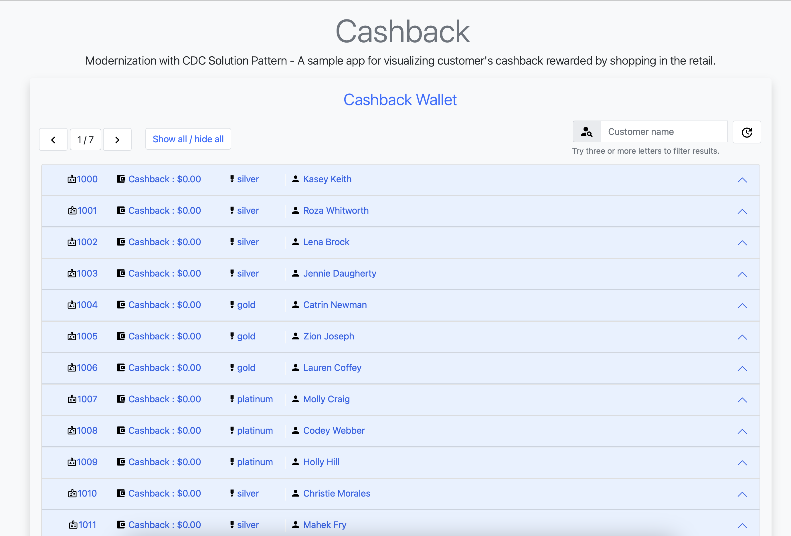
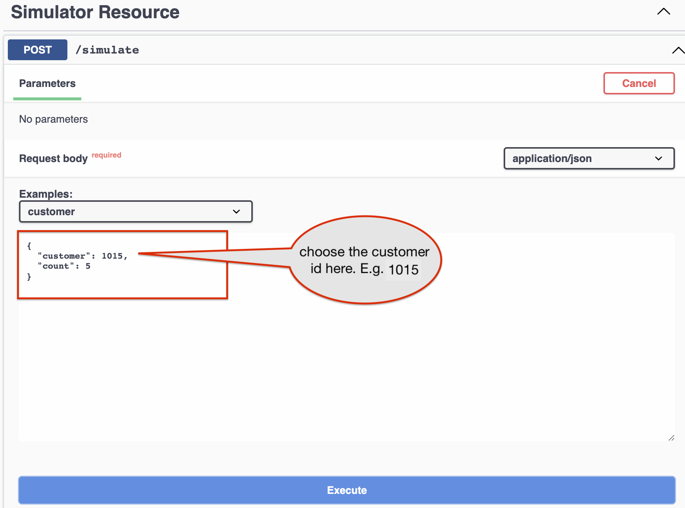
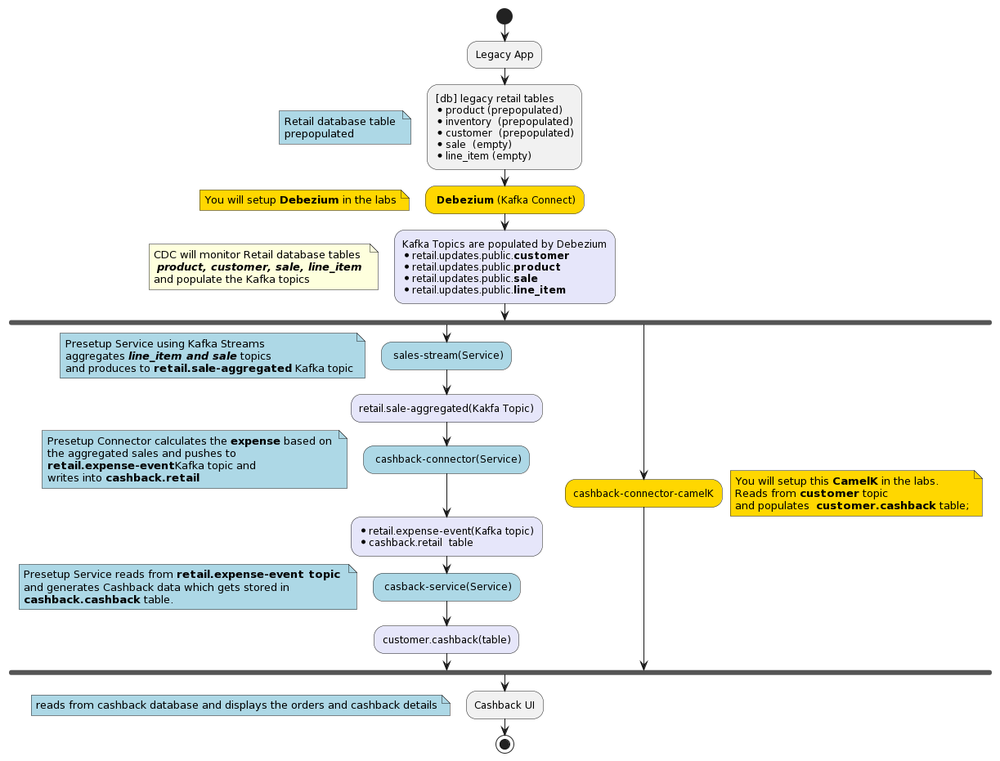

:icons: font

:toc:

== Workshop Activities

In this labs, you will perform the following activities

* Explore the lab environment
* Setup Debezium on OpenShift 
* Observe Kafka messages generated by Debezium
* Simulate an E2E Order Placement -> Cashback Scenario
* Conclusion

== Explore the lab environment

. In a browser window, navigate to the console of the lab OpenShift cluster at link:%openshift_cluster_console%[role=external,window=console]. Login with your username and password (`%user%/%user_password%`). 
. In the Developer perspective of  *cashback-%user%* namespace., open the *Topology* view. Expect to see something like this (rearrange the topology as you see fit):
+
 
+
The deployed topology consists of:


[cols="28m,~"]
[frame=all, grid=all]
|===
|*Service* | *Description*

| kafka-operator +
(strimzi-kafka)
| AMQ Streams provides Operators for managing a Kafka cluster running within an OpenShift cluster.

| kafka-connect +
(strimzi-kafka-connect)
| Framework for integrating Kafka with an external data source or target,

| kafdrop
| a kafka client ui to facilitate the visualization of events and topics;

| retail-db 
| PostgreSQL database used by the legacy services;

| retail-simulation +
(retail-connectors)
| a Quarkus application that allows simulates placing an order in the legacy application; entries are persisted  in the retail database;

| sales-streams +
(retail-connectors)
| Quarkus + Kafka Streams event-driven service for purchase data (sales data) aggregation and synchronization;

| cashback-connector +
(retail-connectors)
| Camel + Quarkus service for event-driven processing of expenses;

| cashback-db
| PostgreSQL database for cashback related information. 

| cashback-service +
(retail-services)
| Quarkus + Camel event-driven service responsible for calculating and maintaining cashback data up-to-date in the new database;

| cashback-customer-connector +
(retail-services)
| CamelK service for event-driven processing of customers (not deployed yet) 

| cashback-ui +
(retail-services)
| Quarkus + Panache back-end service to facilitate the visualization of Cashback Wallet information;

|===


=== Accessing the services

You can easily access the three services that exposes a UI through the exposed routes accessible from the OpenShift console -> Routes at link:%openshift_cluster_console%/k8s/ns/cashback-%user%/routes[role=external,window=_routes]
    
image::images/cdc/ocp_routes.png[]

=== Databases

* The `retail-db` (legacy) and `cashback-db` (cashback wallet) are desgined as seen below 
* Debezium monitors the legacy database for any changes to the `customer`, `product`, `sale` and `line_item` tables and streams every row-level change to Kafka
* Kafka consumers react to these changes to build the Cashback Wallet functionality
+
 


==== Inspect retail-db
* Navigate to the  *cashback-%user%* namespace if you aren't already here
* Click on the `retail-db` deployment and navigate to the pod's terminal. 
* Use the following Postgresql commands to inspect the legacy `retail` Postgresql database
- Nnote: sequences are ignored in the below rendering
+
```
psql 
\c retail
\d
               
               List of relations
 Schema |       Name       |   Type   | Owner  
--------+------------------+----------+--------
 public | customer         | table    | retail
 public | inventory        | table    | retail
 public | line_item        | table    | retail
 public | product          | table    | retail
 public | sale             | table    | retail
 ...

```

* These  databases are used by the legacy system
- The `product` and `inventory` tables hold the data of the products available for sale
- The `customer`  table holds the data of the retail's customers
- When a sale happens within the legacy systems, the order details is stored in the `sale` and `line_item`  tables.
+


== Setup Debezium on OpenShift 

You will now setup Debezium which monitors any database changes from the legacy `retail-db` and streams them as events into Kafka topics.

[NOTE]
====
The necessary Kafka topics have been already created for you.
====

* To create a *Debezium connector* you will use the YAML file at https://gist.githubusercontent.com/jayachristina/7f8589cdf2a641eeb5f30d7aa1b31b84/raw/5b02765b0715e576d8bde81bf615226e53c9f02b/debezium-setup.yaml[debezium-setup.yaml^]. 
* Note that in this YAML file, the tables that need to be watched for change data events are mentioned. In this case, these are the tables which are being watched.
```
    table.include.list: "public.customer,public.sale,public.line_item,public.product"
```
*  You can setup and run a Debezium connector via CLI or via the OpenShift console. Choose  either of the following options to setup Debezium (CLI or OpenShift Console).

=== Option A: Setup through CLI
.[underline]*Click to view CLI-based instructions*
[%collapsible]
====
* Open a *Terminal or Command Prompt* in your laptop and browse to the new  folder (e.g. `rhte23`) you have created as part of the prerequisites. 
- If you haven't created one, now is a good time to do so. You will use the prompt/terminal to run a few `oc` commands

* In the  OpenShift console, from the top-right corner, click on the *%user% > Copy login command* menu item.
+
 

* When prompted, login using  (`%user%/%user_password%`), and click on `Display Token`
* Copy the `oc` command under `Log in with this token`. It will look something like this +
`oc login --token=sha256~qwertyu --server=https://api.clusterxx.opentlc.com:6443`
* In your laptop's  terminal or command prompt, paste the copied login command.
* Choose `y` when prompted to `Use insecure connections? (y/n):`
* Make sure you are in *cashback-%user%* namespace. If not type `oc project cashback-%user%`
* Create a local file in the current folder you are in named  `debezium-setup.yaml`  and copy the YAML from the gist https://gist.githubusercontent.com/jayachristina/7f8589cdf2a641eeb5f30d7aa1b31b84/raw/5b02765b0715e576d8bde81bf615226e53c9f02b/debezium-setup.yaml[debezium-setup.yaml^] 
+
 

* Run the command `oc apply -f debezium-setup.yaml` to setup Debezium. 
+
```
##run this command
oc apply -f debezium-setup.yaml 

##typical output
kafkaconnector.kafka.strimzi.io/debezium created ##output 
```
* In the *Administrator view* of OpenShift, navigate to the tab  *Operators > Installed Operators > Red Hat Integration - AMQ Streams > Kafka Connector*. Choose `Current namespace only`. 
- Note: Make sure you are in the *cashback-%user%* namespace.
* Notice that the *debezium KafkaConnector* has been created, and the status is in `Condition:Ready` state state. You may need to wait for about a minute.


====

=== Option B: Setup through OpenShift console
.[underline]*Click to view console based instructions*
[%collapsible]
====
In this method you will use the OpenShift console to setup Debezium

* In the *Administrator view* of OpenShift, navigate to  *Operators > Installed Operators > Red Hat Integration - AMQ Streams > Kafka Connector*. Choose `Current namespace only`. 
- Note: Make sure you are in the *cashback-%user%* namespace.
* Click on *Create KafkaConnector*
* Choose the `YAML` view, and replace the content with the `YAML` from the gist https://gist.githubusercontent.com/jayachristina/7f8589cdf2a641eeb5f30d7aa1b31b84/raw/5b02765b0715e576d8bde81bf615226e53c9f02b/debezium-setup.yaml[debezium-setup.yaml^]
* Click on *Create*
* Wait till the *Status* turns `Condition:Ready` state. You may need to wait for about a minute.


====

== Observe Kafka messages generated by Debezium

Once Debezium has been setup, it now monitors the lgacy *retail database* and streams all the changes to the Kafka topics. AMQ Streams (Kafka) has been already setup for you on OpenShift through the use of Operators.  + 
[NOTE]
====
The Kafka topics can be viewed at *Administrator view -> Operators -> Installed Operators -> Red Hat Integration - AMQ Streams -> Kafka Topic*
====

* The first time Debezium connects to the Retail PostgreSQL server, the connector takes a *snapshot* of the schemas speficied.
* In this case, when Debezium setup is complete, the data from specified tables within the `retail-db` are pulled  and the Kafka topics are populated. 
* Debezium creates one topic per table. The topics created are:
- `retail.updates.public.customer` -> from the `retail.customer` table
- `retail.updates.public.product` -> from the `retail.product` table
- `retail.updates.public.sale` -> from the `retail.sale` table (this would remain empty to start with)
- `retail.updates.public.line_item` -> from the `retail.line_item` table (this would remain empty to start with)

* Launch `kafdrop` in a browser and explore the following topics on the landing page. You can access `kafdrop` from OpenShift console from link:%openshift_cluster_console%/k8s/ns/cashback-%user%/routes[role=external,window=_routes]
** `retail.updates.public.customer`
** `retail.updates.public.product`
+
[NOTE]
====
It is important to note here that Debezium doesn't respect the relational database, keys and constraints. To make sense of the stream of data, we can use Kafka Streams help to  drive the data relationship in the microservices which consume from the Kafka topics.
====

* Click on *_Topic name_ > View Messages > View Messages* to view the events

+
 

* Expand one of the messages, and take note of these elements
-  `before` -> content is null because this is a new entry and there is no old data
- `after` -> has the fields from the db table retail.product
- `"op": "r"` -> this is a snapshot event;  the value for snapshot events is r, signifying a READ operation.

+
 

=== Setup the CamelK Connector to populate _cashback.customer_ table

This is the final step before you can simulate a sale from the legacy system and view the corresponding data in the cashback wallet.

* You will setup a *CamelK connector* which will populate the *customer* data into the new `customer` table in *cashback db*. 
* In addition to the `sale` and `line_item` data, the `customer` details are also needed in the cashback database to fully build out the Cashback Wallet functionality. 

* Access the Commmand Prompt/Terminal in your laptop where you have created a new folder for this workshop
* You should have installed `kamel` CLI as part of prerequisites. Make sure it is accessible by running the command `kamel` in terminal
* Clone the *CamelK Connector* from git +
 `git clone https://github.com/solution-pattern-cdc/cashback-connector-camelK`

+
.[underline]*Click here to examine the CamelK connector's code*
[%collapsible]
====

 

-> (1) this section refers to reading from the kafka `customer` topic
-> (2) if the "op" : "r" or "c" which means this is a new customer and the customer data is inserted into the customer table
-> (3) if the "op" : "u" which means an existing customer needs to be updated in the customer table

====

* Run the `kamel` command to setup the connector from the folder you (git) cloned in the previous step
```
cd cashback-connector-camelK
kamel run -n cashback-%user% CashbackCustomerConnector.java
``` 

* You would see such an output similar to this
```
kamel run -n cashback-%user% CashbackCustomerConnector.java 

Modeline options have been loaded from source files
Full command: kamel run -n cashback-%user% CashbackCustomerConnector.java --property=file:cashback-customer-connector.properties --dependency=camel:jdbc --dependency=mvn:io.quarkus:quarkus-jdbc-postgresql 
Integration "cashback-customer-connector" created
```
* The installed  operator  can be viewed in the *OpenShift console -> Administrator > Installed Operators > Red Hat Integration - Camel K > Integration*. Choose `Current namespace only`. 
- Note that it may take a couple of minutes befoere the connector's status turns `Running`

 

** You will also notice that a new pod has been created in the link:%openshift_cluster_console%[role=external,window=console]

 

* From the Developer View link:%openshift_cluster_console%/topology/ns/cashback-user1?view=graph[role=external,window=console], access the Terminal of the pod `cashback-db`. 
* You can query the cashback db to confirm that the `customer` table is now populated.
- Note: You can types ctrl+c to exit from the listing
```
psql
\c cashback 
\d    
select * from customer;
```

* The new CamelK connect that your created has consumed from the Kafka topics, and pushed the data into the *cashback.customer* database. Any change to the *legacy customer database* will be monitored by Debezium, and change events will be streamed to Kafka. This new connector will consume those changes and the cashback.database will kept upto date. 

== Simulate an E2E Order Placement -> Cashback Scenario

All the code and configuration setup is now complete. +
Let's take this system on a test drive by simulating a sale in the legacy system.

[NOTE]
====
You can get the URLs for the UIs from Routes listing in OpenShift console from link:%openshift_cluster_console%/k8s/ns/cashback-%user%/routes[role=external,window=_routes]
====

* Open the `Cashback UI` in a browser tab. You will notice that none of the customers have any *Cashback*. 
+

 

* Open the `retail-simulation` UI in a browser and append `/q/swagger-ui` to the URL in the address bar and hit enter 
- It reads something like this `https://....xx.xx.opentlc.com/q/swagger-ui/` +
+
 
* Click on the *POST* button and then choose  *Try it out*. 
+
 
* Choose a customer without any cashback - e.g. `1015` and click on `Exectute`. This will generate five purchases for this customer.  
+
 

* You should get an *HTTP 200* result, with a message about the number of generated sales.
+
 

* Open the *Cashback Wallet UI* in your browser and refresh the page. Navigate to the right page in the UI to view the customer you have simulated the sale for. 
* You should be able to check the new earned cashback, and a list of expenses for each purchase of your customer! In this case 5 sales have been simulated.
+
 


=== Walkthrough of the system

* In the *legacy system*, the sale details are stored in two different tables, the `retail.sale` and `retail.line_item`. So if you simulate five sales, the data will be stored in both tables and streamed as events by Debezium to two respective topics. +
* Through a series of orchestrated operations, the data will be aggregated, processed, and enriched by the `sales-aggregated` service , to finally be used to calculate and update the cashback wallet's values by the `cashback-service`.
* Open Kafdrop in your browser. Locate and click on the topic `retail.sale-aggregated`, and then, click on view messages. This is the result of the Kafka Streams (`sales-stream` service) operations of aggregation, processing and enrichment of the events' data (`sale` and `line_item`) that were streamed by Debezium:
+
 
* The `cashback-connector` and `cashback-service` perform the actual cashback operations and generate the *Cashback Wallet* and *Customer Expense* details.
* The Cashback UI  uses these tables from the cashback database to display the Cashback Wallet of the customers.

==== Flowchart of activities for a deeper look
.[underline]*Click to view flowchart diagram*
[%collapsible]
====

====

== Conclusion

In this section you have learned :

* how Change Data Capture enabled the realisation of building new use cases on legacy applications
* how a whole new cashback wallet capability could be added without impacting the legacy systems by using a distributed, event-driven and microservice-based architecture;
* Learn in-depth details about how services can be orchestrated;

The solution is built on top of a hybrid cloud model, with containerized services running on OpenShift (can be on a private or public cloud depending on how you provision the demo) consuming a self-managed AMQ Streams on OpenShift. This can be easily extended to use OpenShift streams as well.

This design is only possible by the designing the architecture based on the Change Data Capture pattern - which was delivered with Debezium and Kafka Connectors.