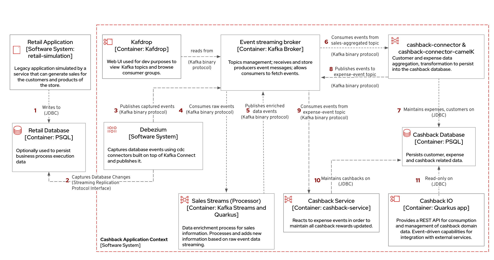

== Modernize an existing application with CDC

This Solution Pattern demonstrates how https://www.redhat.com/en/topics/integration/what-is-change-data-capture[Change Data Capture^] (CDC) and event-driven architectures supports the extension of existing capabilities of applications with no changes to legacy apps. 

The story behind this solution pattern is of a retail store that has been active in the market for more than fifteen years. This retail store uses a single application to manage the `inventory`, `catalog` and `sales` during their daily operations. It's getting hard for this company to compete with more high-tech competitors, but the technical team finds it hard to fully  adopt cloud-native technologies to enhance the organization's services.

Now, business wants to introduce new *Cashback Wallet business* as an extension to their existing retail system. 

=== Challenges faced

But there are challenges

* The technology has been acquired many years ago, and no source code is available.
* The application, application server and databases are installed and running in an on premise environment.
* The domain experts knowledge is limited to keeping the inventory and catalog list updated.
* There are operations running 24/7 using the sales application,  and any immediate modernization efforts is risky and could impact their income directly

=== Solution Approach

A recommended approach to this requirement is to consider adopting an Enterprise Integration Pattern for data integration, more specifically, adopting the Change Data Capture (CDC) pattern.

* requires no source code changes in the existing services.
* uses an event-driven architecture to support the extension of the legacy stack. The architecture includes new microservices, event streaming and event processing tools
* the core concept builds on data integration between legacy and new services through usage of asynchronous events. 

A quick view of solution flow:

* Using Debezium, the database becomes an event stream. Since data changes are directly tracked, the legacy application code won't require any changes.
* The captured data changes are pushed to topics in a Kafka broker.
* New microservices can now subscribe to the relevant topics and use these events to obtain the information needed to build new functionality

 

In the next step, you will implement this solution to introduce  *Cashback Wallet business* based on CDC.
