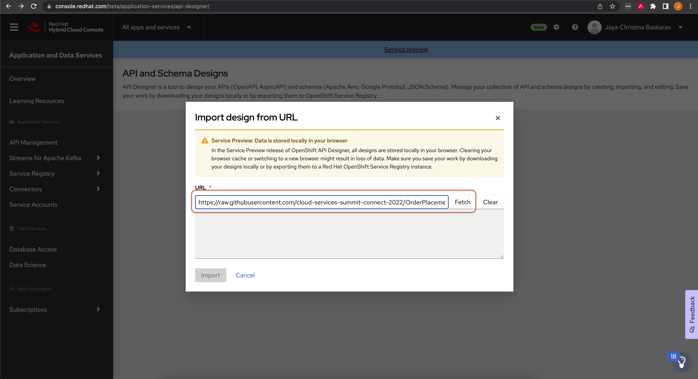
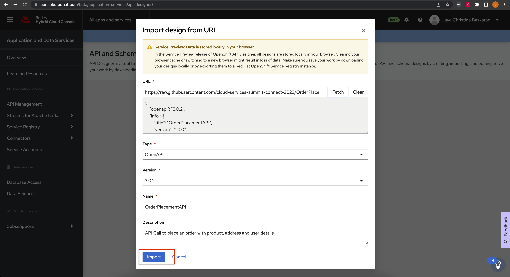
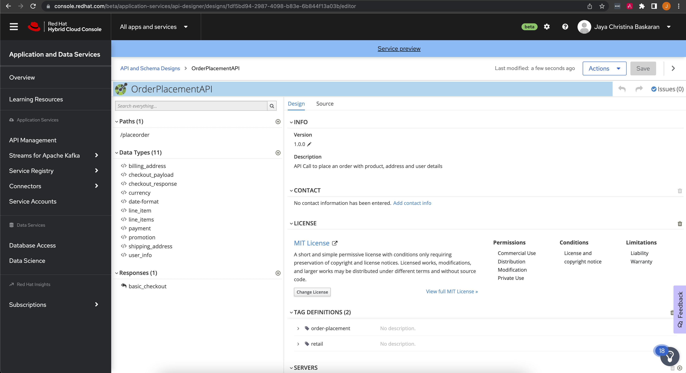
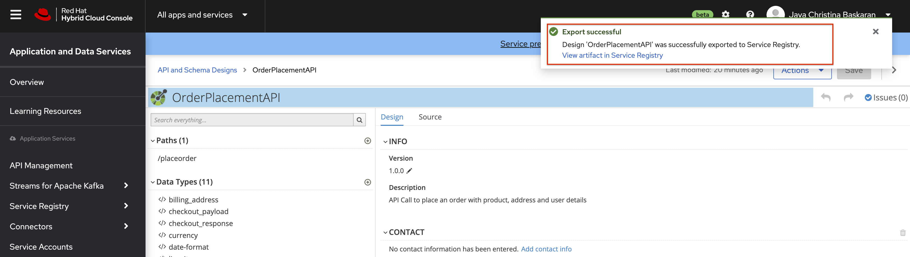
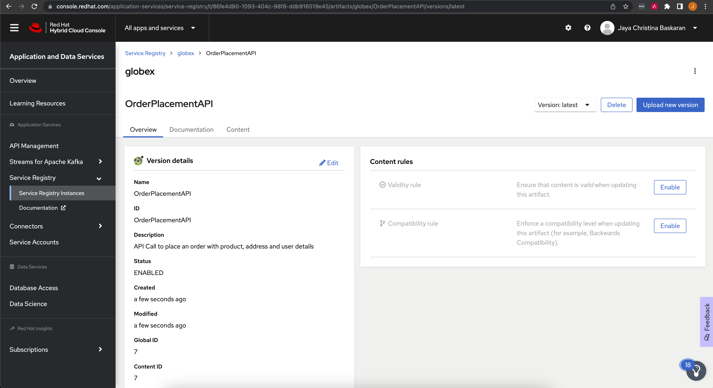

:icons: font

== Red Hat OpenShift API Designer

As part of the API-First approach, the first step  - of course - is to to design those APIs. API Designer is a tool to design your APIs (OpenAPI, AsyncAPI) and schemas (Apache Avro, Google Protobuf, JSON Schema). You can manage your collection of API and schema designs by creating, importing, and editing. Save your work by downloading your designs locally or by exporting them to OpenShift Service Registry. 

In this section you will import an existing API that will be used as a starting point, explore the designer while making a few minor edits and then export this to a Service Registry

API Designer is under `Service preview` and can be accessed through the Red Hat Hybrid Cloud Console via this https://console.redhat.com/beta/application-services/api-designer[API Designer,role=external,window=_blank]

[NOTE]
====
OpenShift API Designer is in Beta and all your designs are stored locally in your browser. Clearing your browser cache or switching to a new browser might result in loss of data. Make sure you save your work by downloading your designs locally or by exporting them to a Red Hat OpenShift Service Registry instance.
====

=== Import API 

. Navigate to OpenShift API Designer tab and  login using your  Red Hat account
+
image::images/api-designer-landing-page.png[]

. In the landing page, click on the "Import design" buton and choose `"Import from URL"` option.
 https://raw.githubusercontent.com/cloud-services-summit-connect-2022/OrderPlacementAPI/main/openapi/openapi-spec.yml[OrderPlacementAPI OpenAPI specs]
+
image::images/api-designer-import-url.png[]

. Paste the following URL into the URL field and click on the button *Fetch*. 
+
[.console-input]
[source,bash]
----
https://raw.githubusercontent.com/cloud-services-summit-connect-2022/OrderPlacementAPI/main/openapi/openapi-spec.yml
----
+

. Observe  the fields that are populated with the data from the imported API specifications. Click on *Import* button to import the specs into the API Designer
+

. You can now view  the OrderPlacementAPI on the broswer. You can explore the Paths, Data Types and Responses that are part OrderPlacementAPI
+

=== Explore and edit the API 

=== Export this API into the Service Registry
The next step is to export this API into the Service Registry so that this can be used as a single source of truth by the developers.

. Click on the `Action` button found on the top-right corner.

. Choose the `Export to Service Registry` option from the drop down

. Fill the form `Export to Service Registry` with the following details. Click on the `Export` button to complete the action.
+
[width="50%"]
|=======================================
| Registry Instance  | globex
| Group              | globex
| ID                 | OrderPlacementAPI
| Version            | 1.0              
|=======================================
+
image::images/api-designer-export-2-osr.png[]

. A success message wull appear on the top right of the screen notifiying that the API export is  successful
+

. Click on the `View artifact in Service Registry` to view the imported API on OpenShift Service Registry
+

In the next step you will explore the OpenShift Service Registry.