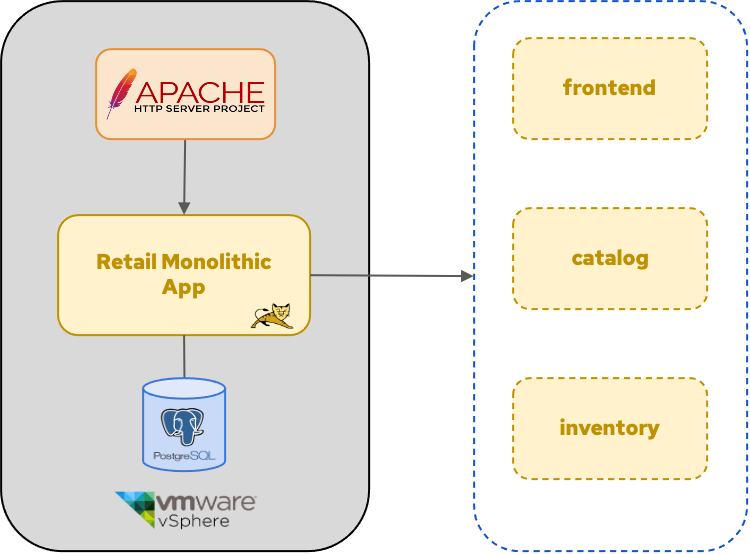
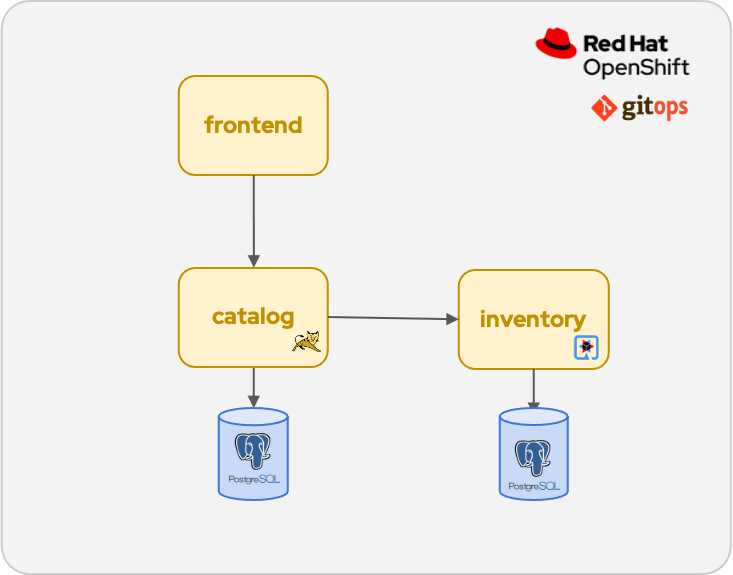
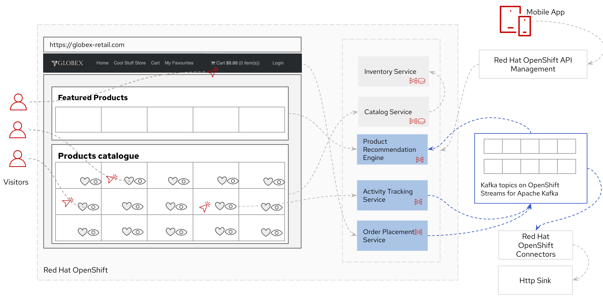
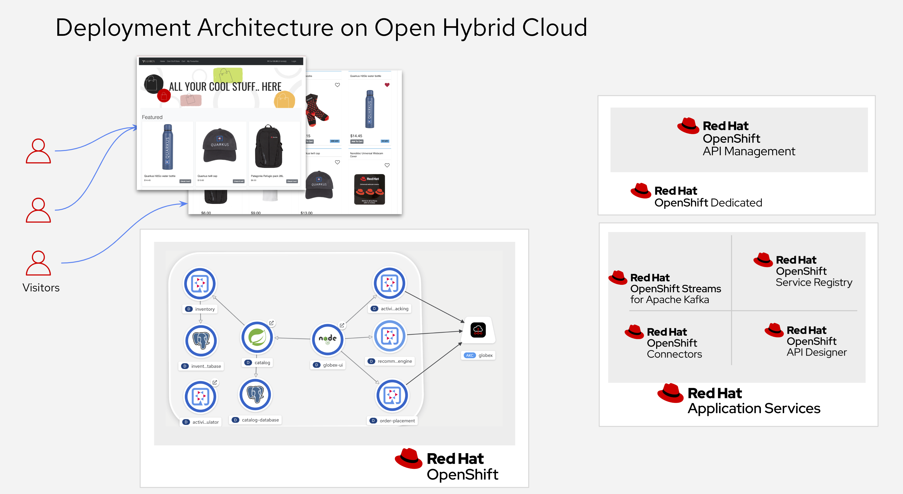

:icons: font

== Introduction

=== Add Event Streaming capabilities 

This use case involves tracking user activity and performing streaming analytics on a retail website's user activity stream.

Most enterprises undertake app modernization of existing monolithic applications to microservices to enable cloud adoption and agility. This solution pattern takes a look at enhancing these Applications with Application Services, thereby realizing greater business value.

== Globex Digital Transformation Journey

Globex is a fictitious retail company. The company recently started a digital transformation and cloud adoption journey. As part of this initiative, the development and devops teams have completed the modernization of the existing multi-tier monolithic retail e-commerce web application. The monolithic application was split in a couple of loosely-coupled microservices and the application was re-hosted on OpenShift.

The devops team also adopted GitOps practices for rapid and continuous deployment.

The outcome of this application modernization effort is an increased velocity of application development and deployment, and an overall faster go to market for new functionalities.

A schematic overview of the current state of the application after the first phase of the application modernization effort:

* The application is split into microservices and runs on OpenShift. As such it inherits all the benefits of the de-facto enterprise Kubernetes distribution: horizontal scaling, automated rollout/rollback, bin-packing, self healing, service discovery, load balancing, etc.
* Adoption of GitOps practices decreases Lead Time for Change, Mean Time to Recover and Change Failure Rate while increasing Deployment Frequency

Taking advantage of this new momentum, the business comes up with new requirements for the e-commerce application:

* The ability to track user activity on the website and the mobile application.
* Highlight products which generate most customer interest as featured products.
* Provide a personalized experience for users on the website and mobile application.

== Challenges

However adoption of new technologies such as event streaming requires time and new skills, which are not readily available inside the company. In order to cope with this, the development team decides to adopt *managed cloud services* for an easy and rapid adoption of new middleware components like  Apache Kafka as a streaming platform to ingest and process user activity event streams. 

This allows the teams to focus on the business requirements, without the need to invest in skills and infrastructure to deploy and maintain these components.

== Runtime Architecture

Visitors engage with the Globex retail website in a number of ways

* view list of products
* search for products
* like a product / add a product to favourites
* view product details 
* add products to the shopping cart
* place an order

Each of these activities generate a stream of events which are captured by  the *User Activity Tracking* service. This service then pushes the events into the Kafka streaming platform. 
The events can then be consumed by other services such as the *Product Recommendation* service which powers the list of featured products.
A new *Featured Products* section is created in the front-end web application to showcase the top featured products. 

Since Globex does not want to allow direct access to these backend API services to other channels such as the mobile app, an API Management platform is introduced. The mobile app will access the services through the API Management platform.

== Deployment Architecture

Here is a view of the deployment architecture:

Review the deployment architecture and click *Continue* when you’re ready.
