== Adding API Management capabilities to the application

In this part of the workshop you will use the  OpenShift API Management tenant that has been setup for you. +

[IMPORTANT]
====
For the URL to access `OpenShift API Management`, please ask your instructor. This will be shown on the classroom screen as well.
====

=== Acces Red Hat OpenShift API Management
. In a browser window, navigate to the console of the OpenShift API Management tenant with the URL shared at the workshop by the instructor
. Login with your username and password (`%user%/%user_password%`). 
. You will see that a sample API which can been already setup.
+
image::images/rhoam-landing-page.png[]

=== Create an API Product

A product is a customer-facing API that packages one or more backends. You will create an API  Product manually with the following instructions

. In a browser window navigate to the Red Hat OpenShift API Management
. In the Dashboard, under the APIs section, click *Create Product* in the *_Products_* card.
+
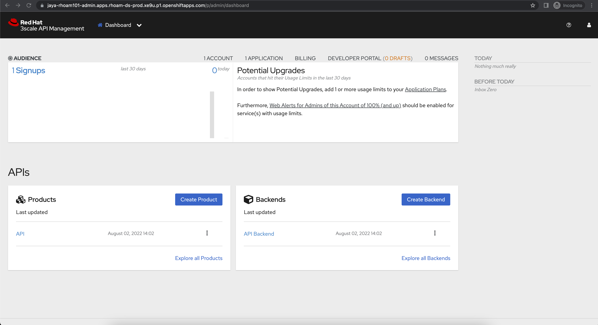

. Provide the following details:
+
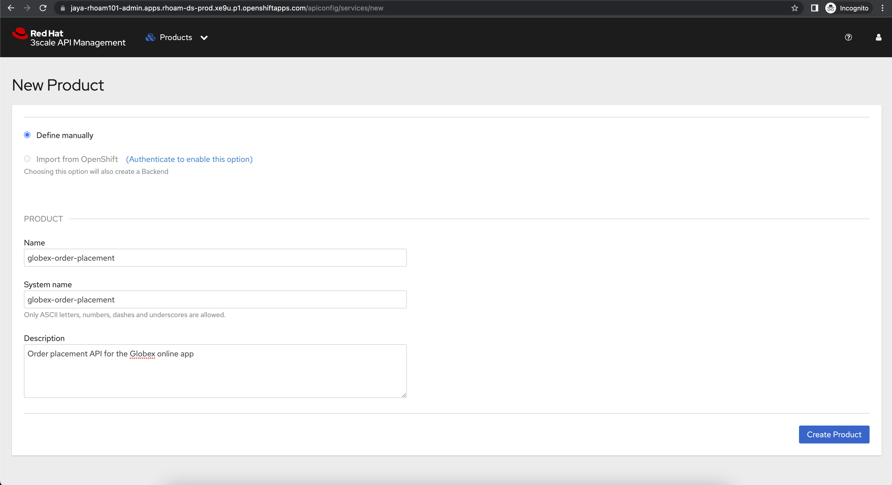
+
[options=header]
[width=60%]
|===
|Field | Value
| Name |  `globex-order-placement`
| System name | `globex-order-placement`
| Description |  `Order placement API for the Globex online app`
|===

. Click *Create Product*.
. A Product `globex-order-placement` is created and you are taken to the Product Overview page
+
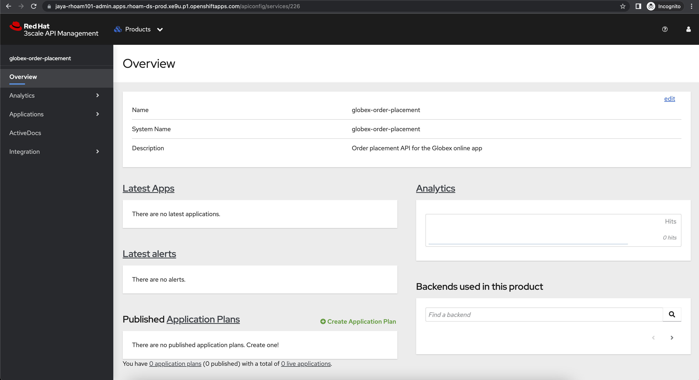

=== Create an API Backend
. Navigate back to the Dashboard. Click `Create Backend` in the *_Backends_* card found in the APIs section.
. Provide the following details and Click *Create Backend*
+
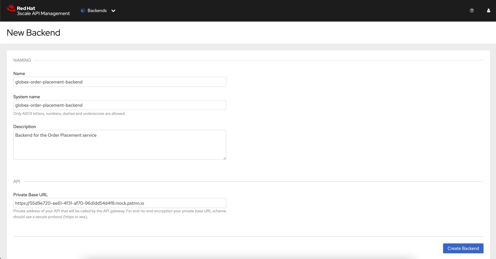
+
[options=header]
|===
|Field | Value
| Name | `globex-order-placement-backend`
| System name | `globex-order-placement-backend`
| Description | `Backend for the Order Placement service`
| Private endpoint | Postman -> OrderPlacementAPI mock server's URL
|===

+ 
[NOTE]
====
At this point, the actual backend service is not available since it is not fully developed yet. So, the Postman's OrderPlacementAPI mock server would be used as the actual server, and that mock server's URL will be managed and secured. 

Once the backend development is complete, the Backend's URL can be updated and published without any change to any of the client applications.
====

=== Add  Backend to Product
. Click on the selector right next to the 3scale logo and choose `Products`
. Choose the Product `*globex-order-placement*` product from the list of products. 
. Navigate to  *Integration > Backend* from the left-hand menu.
+
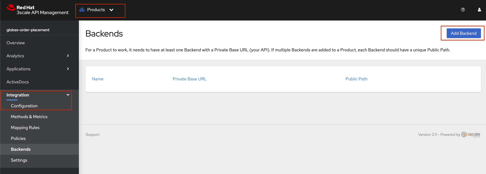
. Click on *Add Backend*, choose `globex-order-placement-backend` from the dropdown, and click the *Add to Product* button
+
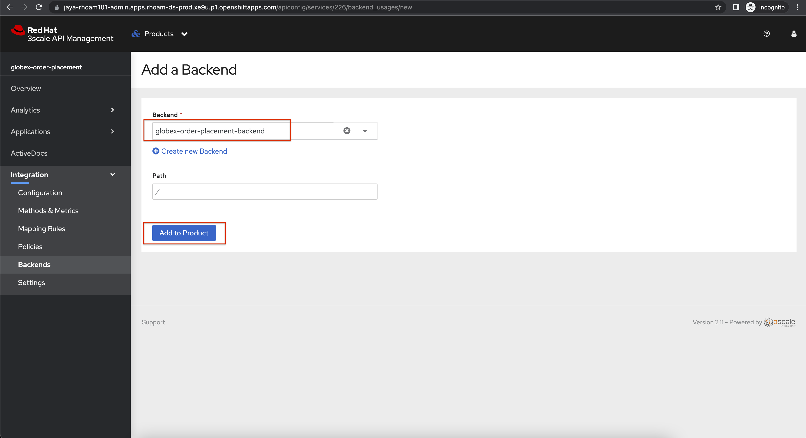
. You will see the new Backend `globex-order-placement-backend` being listed now.
+
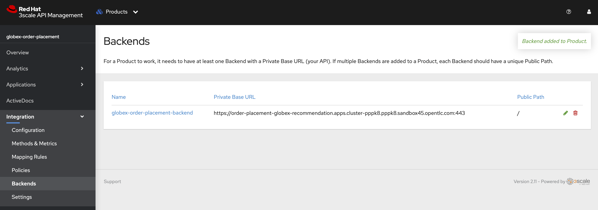

=== Create an application plans to define a customer-facing API product

. Navigate to the `globex-order-placmeent` Product again if necessary.
. In `Applications > Application Plans` menu on the left hand side, click on *Create Application Plan*
+
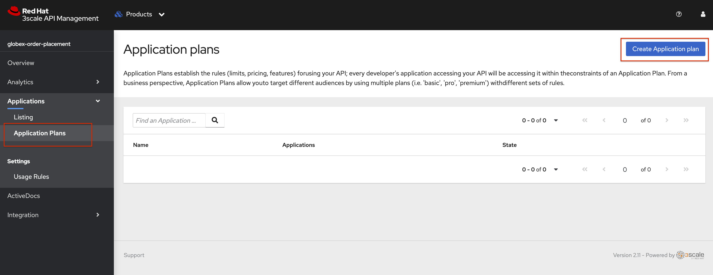
. Provide the following details:
+
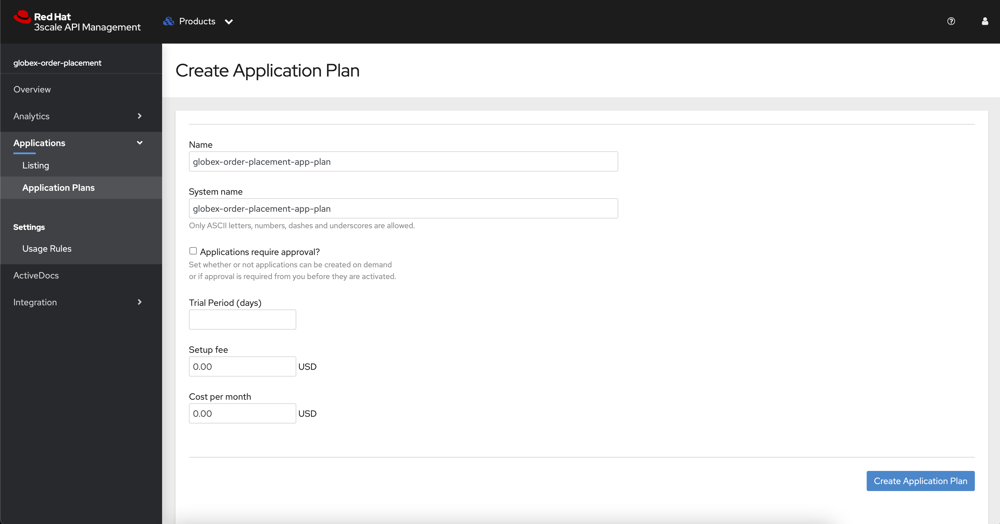
+
[options=header]
|===
|Field | Value
| Name | `globex-order-placement-app-plan`
| System name | `globex-order-placement-app-plan`
|===

. Click *Create Application Plan*.
. The application plan will be created and listed now. Click on the `*Publish*` option from the kebab menu displayed as shown in the screenshot.
+
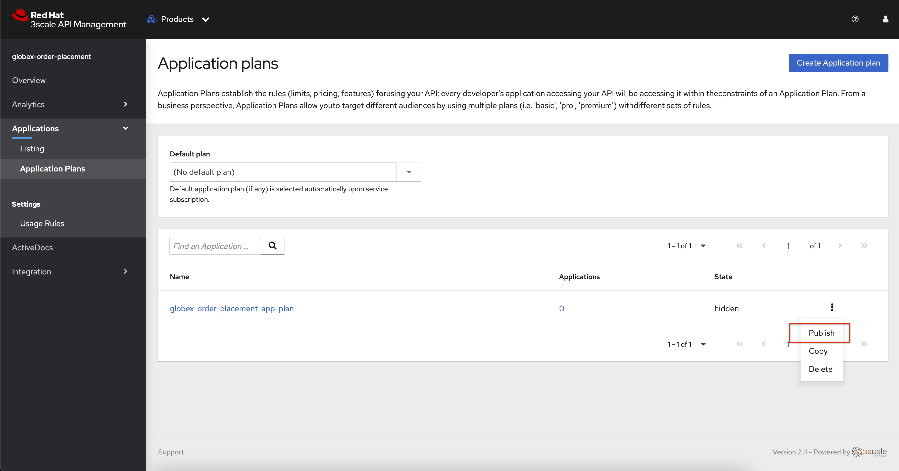
. The state of the application plan will now show as `published`
+
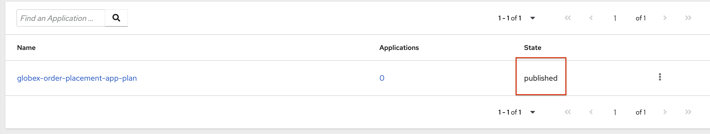

=== Create applications for the default account

[NOTE]
====
An application is always associated with an application plan. Applications are stored within developer accounts.
====

. Navigate to `Audience > Accounts > Listing` from the menu on top of the page right next to the logo.
. For the purpose of this labs, you will use the default `Developer` account that has already been created.
+
image::images/rhoam-developer-account.png[]
. Click on the `+++<u>1 Application</u>+++` link on the top of the page to navigate to the  *Application tab* of this account.
+
image::images/rhoam-audience-add-app.png[]
. You will see the list of applications associated to this user. Note that there is already the default application which has been associated with this user. 
. Click `*Create Application*`. You will view the `*New Application*` page
. Choose the following details in the `New Application` page:
+
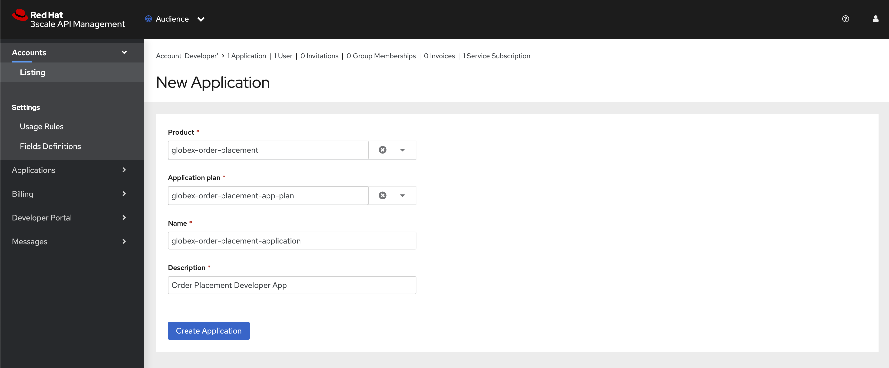

+
[options=header] 
[width="60%"] 
|==========================================
| Field             | Value
| Product           | `globex-order-placement`
| Application plan* | `globex-order-placement-app-plan`
| Name              |  `globex-order-placement-application`
| Description       | `Order Placement Developer App`
|==========================================

. Click `*Create Application*` button.
. You can see your new application details now
+
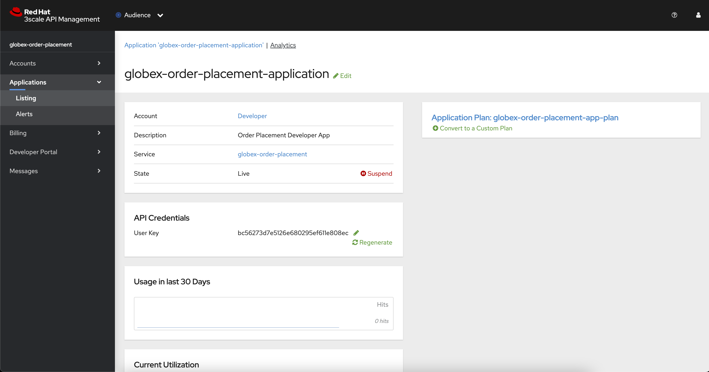
. Make a note of the `User Key` that is displayed under the `API Credentials` section. This will be used while making calls to the API

=== Test integration of the API

. Navigate to the Product > *globex-order-placement* > `Integration` > `Configuration`
. Under *APIcast Configuration*, click `*Promote to Staging APIcast*` to promote the new APIcast configuration to staging.
+
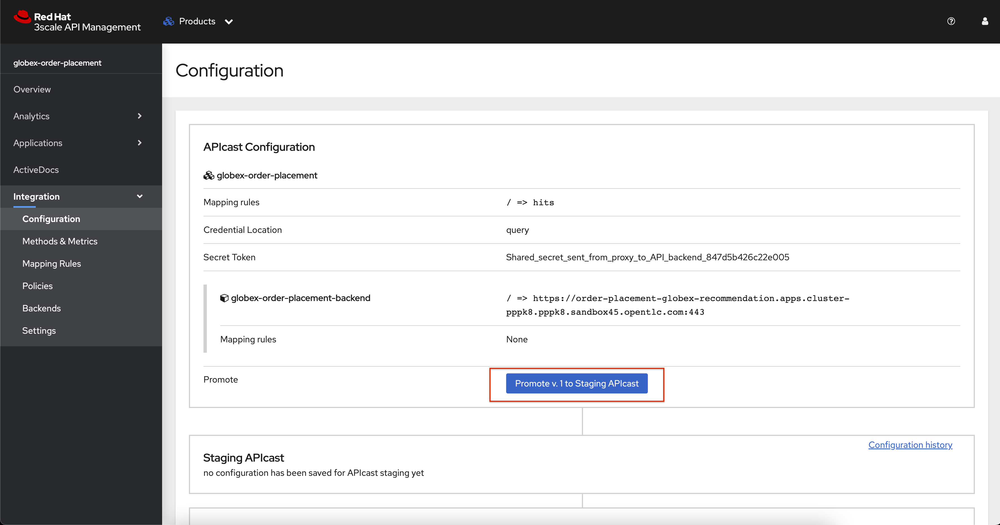

. To test requests to your API product, copy the URL provided along with the curl command in the *Example curl for testing* section. This would look something like this
+
[NOTE]
====
https://globex-order-placement-jaya-rhoam101-apicast-staging.apps.rhoam-ds-prod.xe9u.p1.openshiftapps.com:443/?user_key=bc56273d7e5126e680295ef611e808ec
====
+
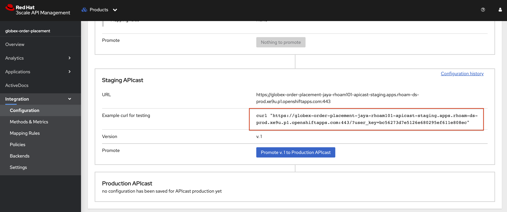
. Include the path `placeorder` in the URL so that it looks something like this
`https://globex-order-placement-jaya-rhoam101-apicast-staging.apps.rhoam-ds-prod.xe9u.p1.openshiftapps.com:443/placeorder?user_key=bc56273d7e5126e680295ef611e808ec`
. Use Postman to run this query. 
.. Open a new tab in Postman - and choose `*POST*`
.. Use the staging URL from the API manager (ensure the placeorder path is included)
.. Use the same sample input as used in the previous mock server tests. 
.. Choose `raw` option under the `Body` section. Paste the sample response into the textarea and ensure the you have selected `JSON` instead of `Text` for the data type.
+
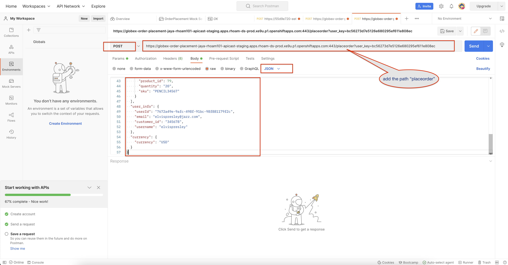

.. Add a header `x-mock-response-name` with value `OK` to ensure the right example gets picked by the mock server.
+
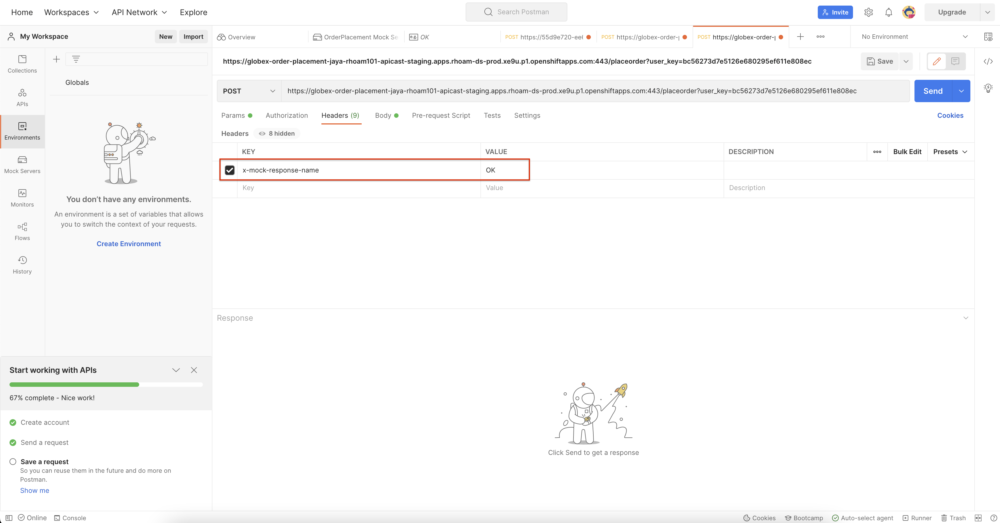

. Click the `Send` button. You should receive a JSON response containing results from Order Placement API.
+
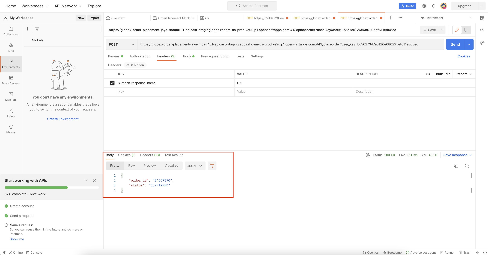
** To check if the API Management is actually securing the API, try altering the api_key's value. You will receive a `Status: 403 Forbidden` error with a message that `Authentication failed`
** In real life, the mobile app would be using the staging and production API endpoints securely to access the APIs.
. back in the API Mangement portal, Click on the Analytics -> Traffic link on the left hand side menu for the `globex-order-placement` product. You will see the Hits details. This section provides insights in terms of the number hits for the product and other traffic analysis details as well.
+
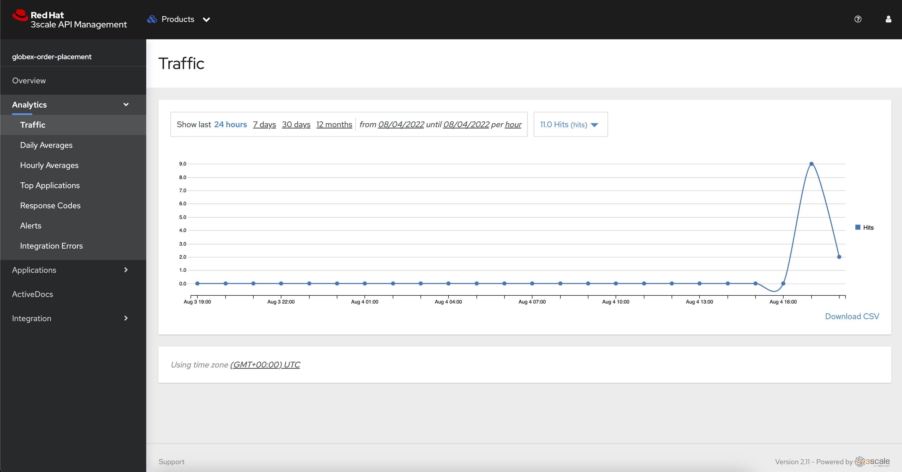

[NOTE]
====
This tenant is setup specifically for this workshop. If you would like to try it out later you can use the http://red.ht/rhoam-sandbox[OpenShift API Management Developer Sandbox,role=external,window=_blank] for a free trial acccount
====
