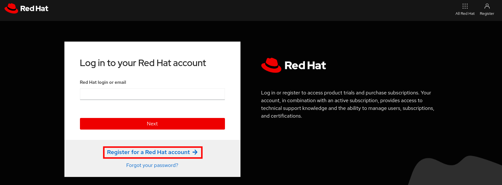
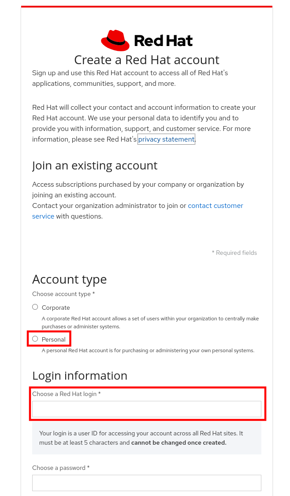
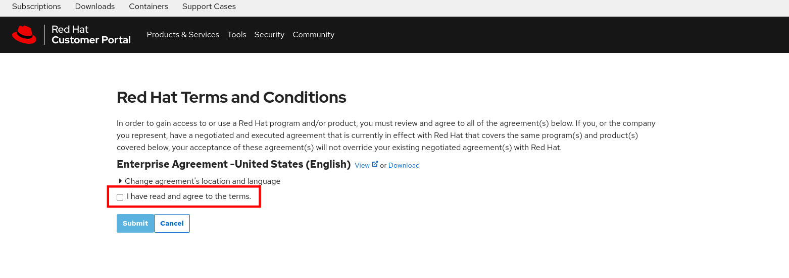
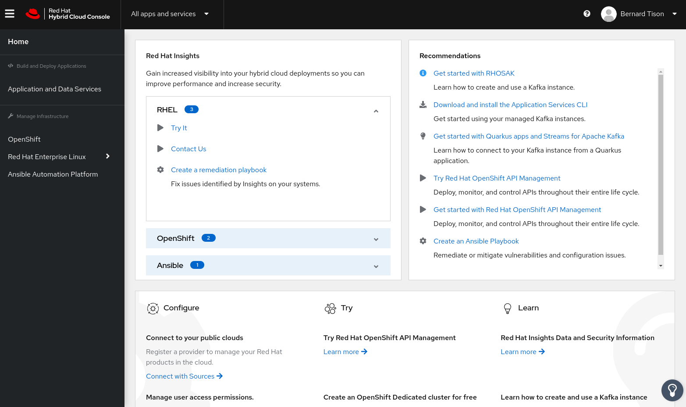
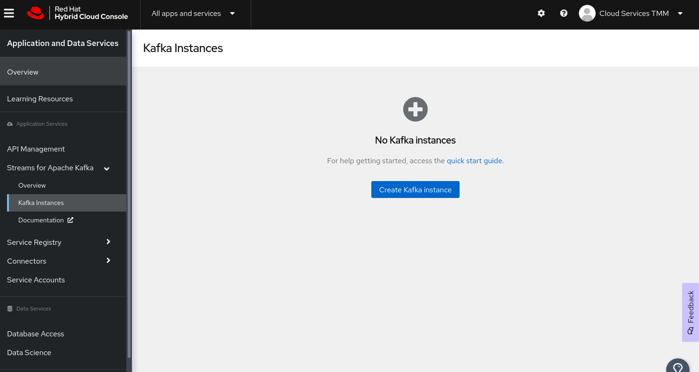
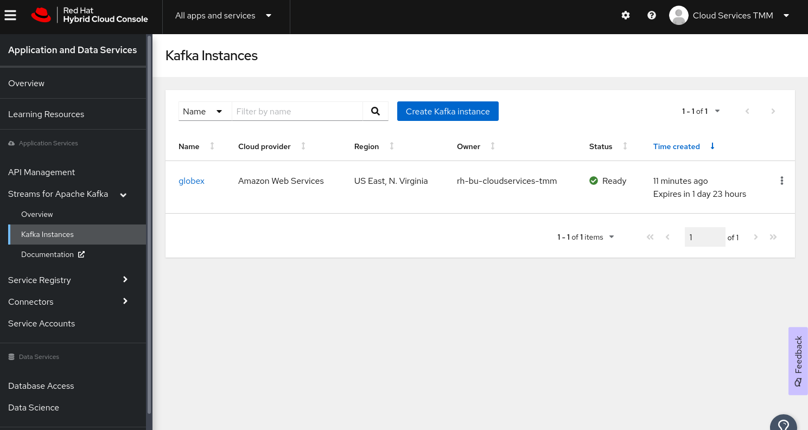

:icons: font

== Prerequisites setup guide

Setup the following prerequisites before executing the rest of the labs.

* Setup a Red Hat account
* Provision a Streams for Apache Kafka instance 
* Setup the following CLI 
- `oc` to access and manage OpenShift environment
- `rhoas` for acessing the Application Services such as Kafka through command line
- `kamel` to run CamelK from your laptop
 
[#newrhaccnt]
== Setup a NEW Red Hat account

:icons: font

[IMPORTANT]
====
This setup instruction is specific to Red Hatters and your customers will not need to do this.

* Create an Red Hat Account ID specifically for this workshop to access the  Red Hat Cloud Services at link:https://console.redhat.com[console.redhat.com,role=external,window=_blank]
* DO NOT use Red Hat Single-Sign On with your email address to access the  Red Hat Cloud Services. This will cause issues because of the max limit to the number of Service Accounts in the Red Hat organization we are all part of, and will cause the workshop to fail.

*Note*: If you have a Red Hat account which is not associated to Red Hat SSO, you can use that and you can skip the rest of the instructions.
====

Follow these instructions to create a new Red Hat account:

. In a browser window, navigate to the Red Hat Hybrid Cloud console at link:https://console.redhat.com[console.redhat.com^]. You are redirected to the login page.
. Click the *Register for a Red Hat account* link to create a Red Hat account.
+

. You are redirected to a registration form. Fill in the form.
** Choose a *Personal* Account type.
** The login name has to be unique. 
** Use a variant of your Red Hat  email address. See note below.

+
[IMPORTANT]
====
Use a variant of your Red Hat  email address like this jaya+rhte@redhat.com - Google will automatically route all emails to jaya@redhat.com but you will still have a variant _username_ so that this Red Hat account doesn’t clash with anything else. Don't use your existing email address to create 
====

+

. Once you completed the form, click *Create My Account* to create your new Red Hat account.
. You are redirected to a Terms and Conditions page. Accept the terms to finalize the creation of your account.
+

. Click *Submit* to finalize the creation of your account.
. You are redirected to the Red Hat Hybrid Cloud Console.
+

== Provision a Streams for Apache Kafka instance

Red Hat OpenShift Application Services is a growing collection of managed cloud services which provide a streamlined developer experience for building and deploying event streams based applications, to design and manage API specifications and schemas, and to manage and secure APIs.

As part of this workshop you provision a *Red Hat OpenShift Streams for Apache Kafka* instance which will be used to hold a stream of activity tracking events which will then be used to promote popular products.

All of Red Hat OpenShift Application Services are provisioned and managed through the Red Hat Hybrid Cloud Console at link:https://console.redhat.com[console.redhat.com,role=external,window=_blank] or with the `rhoas` CLI. This workshop uses the Hybrid Cloud Console. In some steps, you will be provided with alternate  `rhoas cli` based instructions too.

. Navigate to https://console.redhat.com[console.redhat.com,role=external,window=_blank] and log in with your Red Hat account credentials.
+
[NOTE]
====
If you created a new Red Hat account as explained in the previous step, you should already be logged in into the Hybrid Cloud Console.
You will need to accept another set of terms and conditions in order to create a Streams for Apache Kafka instance.
====

. On the https://console.redhat.com[console.redhat.com] landing page, select *Application and Data Services* from the menu on the left.

. On the Application Services landing page, select *Streams for Apache Kafka → Kafka Instances*.
+

. On the *Kafka Instances* overview page, click the *Create Kafka instance* button. Enter `globex` as the name of the instance and select the relevant _Cloud region_ for your Kafka instance and click *Create instance*. This starts the provisioning process for your Kafka instance.
+
[NOTE]
====
This will create a evaluation Kafka instance, which will remain available for 48 hrs. The Kafka instance comes with some limitations, which are listed in the *Create instance* window. The eval Kafka instance consists of a single broker, while production Kafka brokers have a minimum of 3 brokers. 
====

. The new Kafka instance is listed in the instances table. After a couple of minutes, your instance should be marked as ready. 
+

. When the instance _Status_ is `Ready`, you can start using the Kafka instance. You can use the options icon (three vertical dots) to view, connect to, or delete the instance as needed.

Normally, when using Streams for Apache Kafka, the next steps would be to create a service account and set up the Access Control List for that service account. However, in this workshop, you will be using Service Binding to connect applications to the Kafka instance. A service account is created as part of the binding. Once the service account is created, you will need to setup the required permissions for that service account. An alternative is to set up wildcard permissions (valid for all service accounts), but this is generally considered less secure.  

== Setup the following CLI 

- You will need `oc`, `rhoas` and `kamel` CLIs. 
- You can download these and setup in your classpath (or) create a folder (eg. `rhte23`) and place all the CLIs in that folder.

=== Installing `oc` CLI

* Navigate to the link:%openshift_cluster_console%/command-line-tools[Command Line Tools^] page in your OpenShift cluster.
* Under the *oc - OpenShift Command Line Interface (CLI)*, choose the CLI based on your dev environment.
* Download the zip file, extract the `oc` CLI and place it in an appropriate folder

=== Installing `kamel` CLI

* Navigate to the link:%openshift_cluster_console%/command-line-tools[Command Line Tools^] page in your OpenShift cluster.
* Under the *kamel - Red Hat Integration - Camel K - Command Line Interface*, choose the CLI based on your dev environment.
* Download the zip file, extract the `kamel` CLI and place it in an appropriate folder

=== Installing `rhoas` CLI (Optional)
 
[NOTE]
====
Install the `rhoas` CLI  if you prefer to use the  CLI to provision and configure the OpenShift Streams for Apache Kafka instance, and to bind your applications to the Kafka instance - instead of setting up all of this through the web console
====

 * `rhoas` is used to managed *Red Hat OpenShift Application Services* (in this case OpenShift Streams for Apache Kafka) from a terminal.
 Obtain the latest release of the `rhoas` CLI archive for your operating system from the https://github.com/redhat-developer/app-services-cli/releases/latest[Red Hat OpenShift Application Services CLI releases] page on GitHub.
** Install the package (or extract the archive), and add the `rhoas` executable to your path.
** Check the version of the CLI
+
[.console-input]
[source,bash]
----
rhoas version
----
+
[.console-output]
[source,text]
----
rhoas version 0.52.0
----

Thats it! You are all set to try out the Solution patterns!